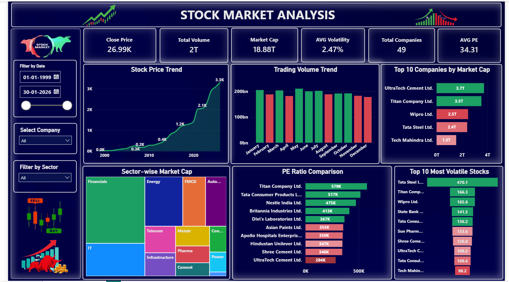

# Stock_Market_Analysis_Dashboard_POWERBI_Project

#  Stock Market Analysis Dashboard | Power BI

An interactive **Power BI Dashboard** developed to analyze the historical performance of **Nifty 50 companies**. The dashboard transforms raw financial data into meaningful business insights using **Power Query, DAX, Data Modeling, and interactive visualizations**.

---

## Project Description

Developed an interactive **Power BI dashboard** to analyze historical stock market performance of **Nifty 50 companies**. Built dynamic KPI cards, DAX measures, and interactive filters to visualize market capitalization, trading volume, stock price trends, PE ratios, sector-wise performance, and stock volatility, enabling data-driven financial insights.

The dashboard helps users monitor market trends, compare company performance, identify highly volatile stocks, and evaluate investment-related metrics through an intuitive and interactive interface.

---

## Project Objectives

- Analyze historical stock market data of Nifty 50 companies.
- Monitor stock price movement over time.
- Compare companies based on Market Capitalization.
- Analyze monthly trading volume trends.
- Evaluate company valuation using PE Ratio.
- Identify the most volatile stocks.
- Understand sector-wise market distribution.
- Build an interactive Business Intelligence dashboard for financial analysis.

---

## Dashboard Features

-  Interactive Date Range Filter
-  Company-wise Filtering
-  Sector-wise Filtering
-  Dynamic KPI Cards
-  Stock Price Trend Analysis
-  Trading Volume Analysis
-  Top Companies by Market Capitalization
-  Sector-wise Market Cap Treemap
-  PE Ratio Comparison
-  Top 10 Most Volatile Stocks
-  Interactive Cross Filtering
-  Professional Dashboard Design

---

## Key Performance Indicators (KPIs)

- Close Price
- Total Trading Volume
- Total Market Capitalization
- Average Volatility
- Total Companies
- Average PE Ratio

---

## Dashboard Insights

- Track historical stock price growth.
- Compare the market capitalization of leading companies.
- Identify sectors contributing the highest market value.
- Analyze monthly trading volume patterns.
- Discover highly volatile stocks for risk assessment.
- Compare company valuation using PE Ratios.
- Explore financial performance using interactive filters.

---

## Tools & Technologies Used

- Microsoft Power BI
- Power Query
- DAX (Data Analysis Expressions)
- Data Modeling
- Data Cleaning
- Data Visualization
- Business Intelligence
- Financial Data Analysis

---

## Dataset

The dashboard is built using historical **Nifty 50 stock market data**, including:

- Company Name
- Date
- Close Price
- Trading Volume
- Market Capitalization
- PE Ratio
- Sector
- Volatility

---

## 📸 Dashboard Preview

> Dashboard Screenshot

---

## Skills Demonstrated

- Data Cleaning
- Data Transformation
- Data Modeling
- DAX Calculations
- KPI Design
- Financial Analytics
- Dashboard Development
- Interactive Report Design
- Business Intelligence
- Data Storytelling

---

##  Future Improvements

- Live Stock Market API Integration
- Real-Time Dashboard Refresh
- Stock Price Forecasting using Machine Learning
- Technical Indicators (RSI, MACD, Bollinger Bands)
- Portfolio Performance Tracker
- Investment Recommendation Dashboard

---

Passionate about Data Analytics, Business Intelligence, Power BI, SQL, Python, and Data Visualization.

---
## ⭐ Support

If you found this project useful, consider giving it a ⭐ on GitHub.

Feedback and suggestions are always welcome!
